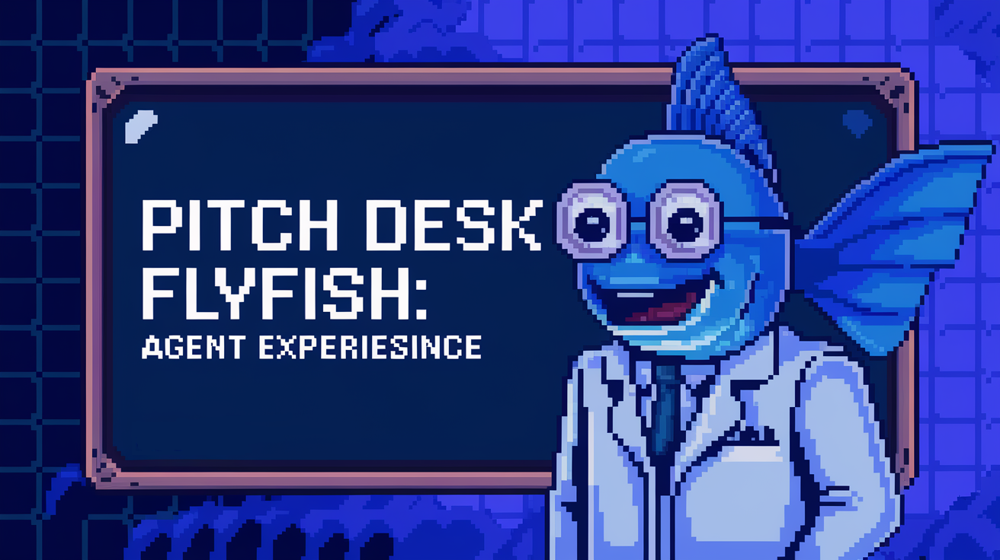
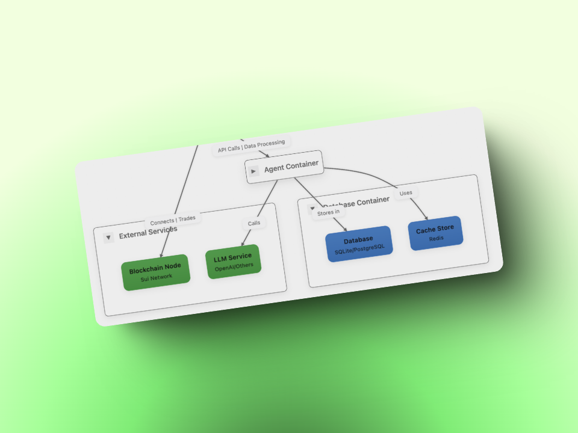

# FlyFish Agent 🐟

FlyFish Agent is the **backend service** powered by **ElizaOS** that handles **AI interactions** and **blockchain operations**. This agent processes **natural language commands** and executes corresponding **blockchain actions**, particularly within the **Sui ecosystem**.

  

## Table of Contents

- [FlyFish Agent 🐟](#flyfish-agent-)
  - [Table of Contents](#table-of-contents)
  - [SuiHelper Character](#suihelper-character)
  - [Architecture](#architecture)
    - [Key Components](#key-components)
  - [License](#license)

## SuiHelper Character

The **SuiHelper** is a specialized AI character included with FlyFish Agent that provides expert guidance for the **Sui blockchain** ecosystem. Key features include:

- **Core Capabilities** 🚀
  - **Sui blockchain** technical expertise
  - **DeFi operations** (staking, yield farming, liquidity)
  - **Security** and risk management
  - **Market analysis** and tokenomics
  - **NFTs** and **Move smart contracts**

- **Technical Integration** ⚙️
  - **Atoma** model provider
  - **Plugins**: 
    - `elizaos-plugin-sui`: Our custom **Sui blockchain** integration plugin
    - `@elizaos/plugin-bootstrap`: Core bootstrap functionality

- **Special Features** ✨
  - Built-in **sentiment analysis** for market queries
  - **Transaction handling** (swaps/deposits/transfers)

The `elizaos-plugin-sui` 🔌 enables direct interaction with the **Sui blockchain**, allowing for:
- Real-time **transaction monitoring**
- **Wallet management**
- **Smart contract** interactions
- **Token** transfers and swaps
- **DeFi protocol** integrations

## Architecture

### Key Components
- **Agent Container**: Central management system for API and data processing
- **External Services**:
  - **Blockchain**: Sui Network integration for blockchain operations
  - **LLM Service**: AI/language model processing
- **Database Services**:
  - **Database**: SQL/PostgreSQL for data storage
  - **Cache Store**: Redis for high-performance caching

## License

This project is licensed under the MIT License - see the LICENSE file for details.